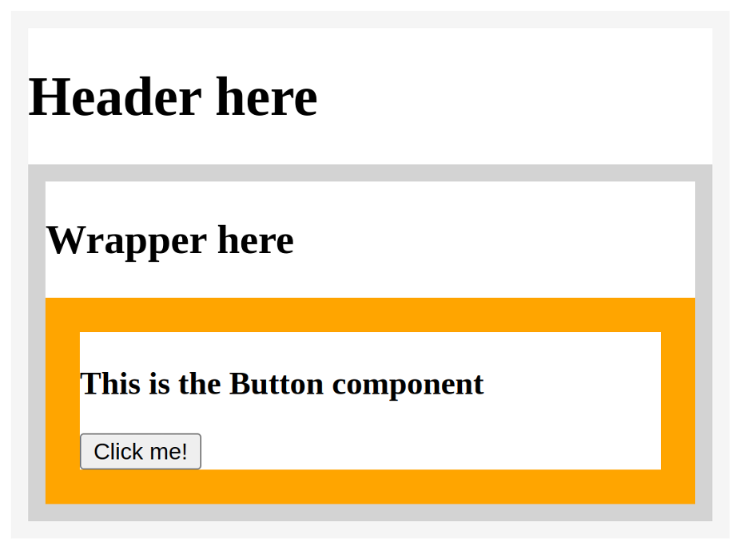

# ***Dynamic Events and How to Handle Them***

## Contents
1. [Data Flow in React](#data-flow-in-react)
    - [Parent-child Data Flow](#parent-child-data-flow)
         - Examples
            - [Parent Component](#parent-component)
            - [Child Component](#child-component)
            - [Grandchild Component](#grandchild-component)
    - [Children and Data](#children-and-data)
    - [Hooks](#hooks)
    - [State](#state)
        - [Stateless Component Example](#stateless-component)
        - [Stateful Component Example](#stateful-component)
    - [Prop Drilling](#prop-drilling)
# ***Data Flow in React***

We will be learning how to detail the flow of data from parent to child and will also be exploring data flow in greater detail by looking at examples.

## ***Parent-Child Data Flow***

In `React`, data flow is a one-way street. The data in `React` flows from a parent component to a child component. The data starts at the root and can flow to multiple levels of nesting, from the root (`parent component`) to the child component, then the grandchild component, and further down the hierachy.

Here is an example:

### **Parent Component:**

```js
function Dog() {
    return (
        <Puppy name="Max" bowlShape="square" bowlStatus="full" />
    );
};
```

### **Child Component:**

```js
function Puppy(props) {
    return (
        <div>
            {props.name} has <Bowl bowlShape="square" bowlStatus="full" />
        </div>
    );
};
```

### **Grandchild Component:**

```js
function Bowl(props) {
    return (
        <span>
            {props.bowlShape}-shaped bowl, and it's currently {props.bowlStatus}
        </span>
    );
};
```

## ***Children and Data***

In `React`, data is passed down from parent components to a child component via `props`. A Child component can't mutate or change its props. It can only read them and re-render. This means that the data comes from the parents and its just consumed in the child components. 

`States data`, on the other hand, is data inside the components that it controls and can mutate. 

## ***Hooks***

Hooks can solve the problem of unnecessary code reuse across components. 

```js
importReact, {useState} from 'react';

const [state, setState] = useState(initialState); //Base Code Structure

const [showMenu, setShowMenu] = useState(false); //Example with Array Destructuring

/*Example without Array Destructuring*/
var menuState = useState(false);
var showMenu = menuState[0]; // Access first item in array
var setShowMenu = menuState[1]; // Access second item in array
```

*Example*: We have a component with an input text field and want to keep track of what the user types into the text field. As the user keeps typing, the local state that holds the string needs to get updated with the latest text.

```js
import { useState } from 'react';

export default function InputComponent() { 
  const [inputText, setText] = useState('hello'); 

  function handleChange(e) { 
    setText(e.target.value); 
  } 

  return ( 
    <> 
      <input value={inputText} onChange={handleChange} /> 
      <p>You typed: {inputText}</p> 
      <button onClick={() => setText('hello')}> 
        Reset 
      </button> 
    </> 
  ); 
} 
```

The state variable `inputText` and `setText` method are used to set the current text that is typed. The `useState` hook is initialized at the beginning of the component. 

By default, the `inputText` will be set to "hello":
```js 
const [inputText, setText] = useState('hello');
```

As the user types, the `handleChanges` function reads the latest input value from the browser's input DOM element, and calls the `setText` function to update the local state of `inputText`:

```js
function handleChange(e) {
    setText(e.target.value);
};
```

Then, clicking the reset button will update the `inputText` button to "hello".

- `inputText` is local state and is local to the `InputComponent`
    - this means that outside of this component, `inputText` is unavailable and unknown

Hooks also have a set of rules that you need to follow while using them:
- You can only call hooks at the top level of your component or your own hooks
- You cannot call hooks inside loops or conditions
- You can only call hooks from React functions, and not regular JavaScript functions

### **The useRef Hook**

`useRef` can be used to access child element directly.

When you invoke the `useRef` hook, it will return a `ref` object. The `ref` object has a property named `current`

```js
function TextInputWithFocusButton() {
  const inputEl = useRef(null);
  const onButtonClick = () => {
    // `current` points to the mounted text input element
    inputEl.current.focus();
  };
  return (
    <>
      <input ref={inputEl} type="text" />
      <button onClick={onButtonClick}>Focus the input</button>
    </>
  );
}
```

Using the ref attribute on the input element, we can then access the current value and invoke the focus() method on it, thereby focusing the input field.

## ***State***

`State` is a component's internal data that determines the current behavior of a component. It is used to store data that affects the the behavior of a component.

It is important because it allows components to stay in sync with each other and ensure that your app behaves as intended.

If one component updates its State, all other components that depend on that State will automatically update as well.

Components sends it State to its children by using `props`. If the child component have their own grandchild components, then the child components might have some States that they send the props to those grandchild components. 

In `React`, State is kept in a state of variables. The main way to change State is to alter these variables. When a component is created, it gets an initial State. The State is used to initialize the component's properties. 

States can be `Stateless` or `Stateful`

There are some rules to follow when deciding if a component should be stateful or stateless.

- Use stateless components when your component doesn't need to maintain its own state in order to work
- Use stateful components when your component does need to maintain its own state in order to work

Common approach for organizing components in React:


Have a stateful component as the parent which then sends its state down to several stateless components that then receive the state and render it on the screen. The children components are stateless because they don't have their own state and only receive their parent state when passed down by using props. 

### **Stateless Component**

```js
function App() {
    return <h1>A completely stateless component!</h1>;
}

// renders text directly
```

### **Stateful Component**

```js
function App() {
    const [ word, setWord] = React.useState("Hello");

    return (
        <div>
            <h1>A state value: {word}</h1>
        </div>
    )
}

// renders text contained in a variable
```

### **Prop Drilling**

Prop drilling is a situation where you are passing data from a parent to a child component, then to a grandchild component, and so on, until it reaches a more distant component further down the component tree, where the data is required.

_Example_:

```js
function Main(props) { 
  return <Header msg={props.msg} />; 
};

function Header(props) { 
  return ( 
    <div style={{ border: "10px solid whitesmoke" }}> 
      <h1>Header here</h1> 
      <Wrapper msg={props.msg} /> 
    </div> 
  ); 
};

function Wrapper(props) { 
  return ( 
    <div style={{ border: "10px solid lightgray" }}> 
      <h2>Wrapper here</h2> 
      <Button msg={props.msg} /> 
    </div> 
  ); 
};

function Button(props) { 
  return ( 
    <div style={{ border: "20px solid orange" }}> 
      <h3>This is the Button component</h3> 
      <button onClick={() => alert(props.msg)}>Click me!</button> 
    </div> 
  ); 
};

function App() { 
  return ( 
    <Main  
      msg="I passed through the Header and the Wrapper and I reached the Button component"  
    /> 
  ); 
}; 

export default App;
```

The top-most component of this app is the `App` component. It returns the `Main` component and that accepts a single attribute, named `msg`.

At the very top of the app, the `Main` function declares how the `Main` component should behave. The `Main` component is responsible for rendering the `Header` component. ***Note, when the `Header` component is rendered from inside `Main`, it also receives the `msg` prop.***

The `Header` component's function declaration renders an `h1` that reads "Header here", then another component named `Wrapper`. 

The `Header` component's function declaration has a return statement, which **renders the `Wrapper` component with the `msg` prop passed to it**

In the `Wrapper` component's function declaration, there's an `h2` that reads "Wrapper here", in addition to **the rendering of the `Button` component, which also receives the `msg` attribute.**

The `Button` component's function declaration is coded to receive the props object, then inside of the wrapping `div`, shows an `h3` that reads "This is the Button component", then there is a button element with an `onClick` event-handling attribute. That is passed to an arrow function which should alert the string that comes from the `props.msg` prop.

All of this code results in the following: 



